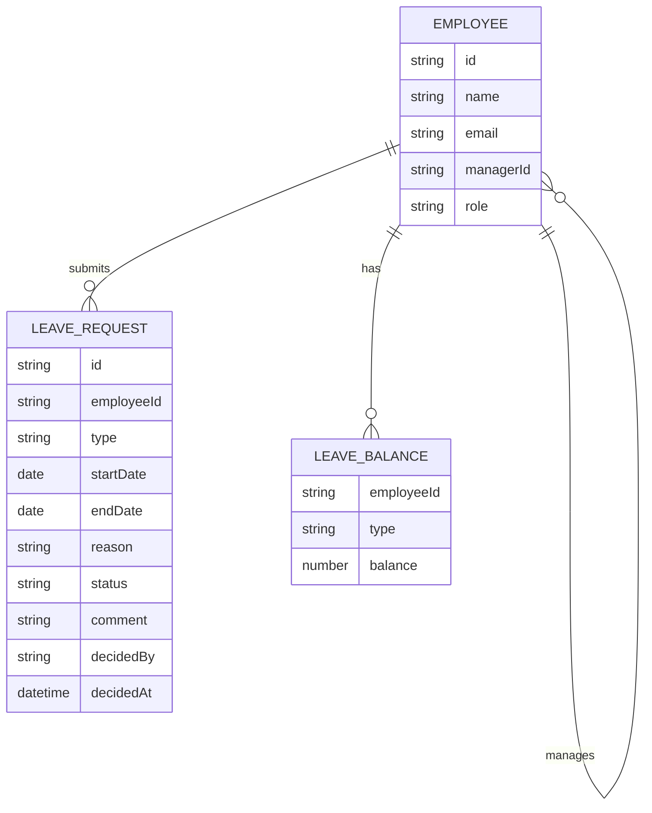

# Domain model

Team Leave tracks employees, the leave requests they submit, and their
per-type leave balances. A manager is simply the employee a given employee's
`managerId` points to.

- `LEAVE_REQUEST.type` and `LEAVE_BALANCE.type` are one of Vacation, Sick or
Personal.
- `LEAVE_REQUEST.status` is one of pending, approved or rejected; `comment` is
required when rejected.
- A `LEAVE_BALANCE` row's `balance` is deducted only when its request is
approved.