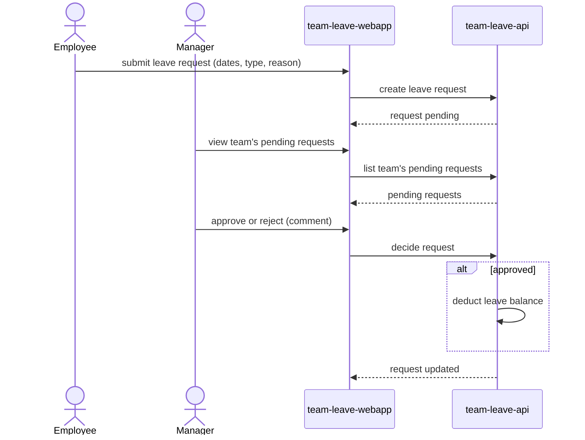

# Submit and approve a leave request

An employee submits a leave request against their balance, and their manager
reviews and decides it.

```mermaid
sequenceDiagram
    actor Employee
    actor Manager
    participant team-leave-webapp
    participant team-leave-api

    Employee->>team-leave-webapp: submit leave request (dates, type, reason)
    team-leave-webapp->>team-leave-api: create leave request
    team-leave-api-->>team-leave-webapp: request pending

    Manager->>team-leave-webapp: view team's pending requests
    team-leave-webapp->>team-leave-api: list team's pending requests
    team-leave-api-->>team-leave-webapp: pending requests

    Manager->>team-leave-webapp: approve or reject (comment)
    team-leave-webapp->>team-leave-api: decide request
    alt approved
        team-leave-api->>team-leave-api: deduct leave balance
    end
    team-leave-api-->>team-leave-webapp: request updated
```